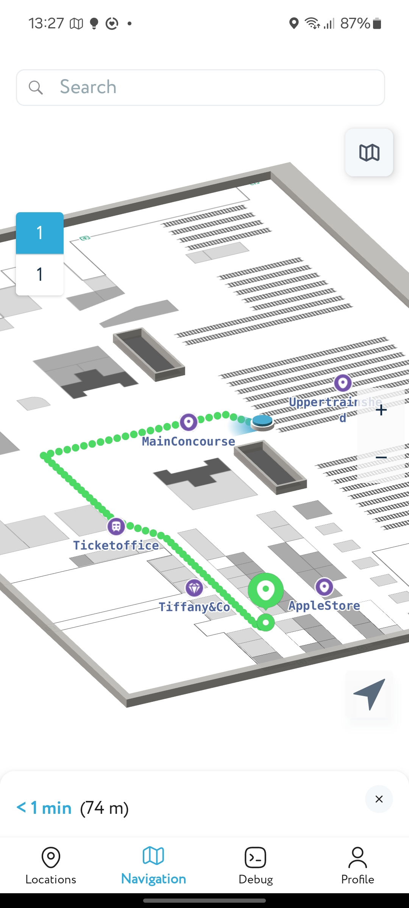
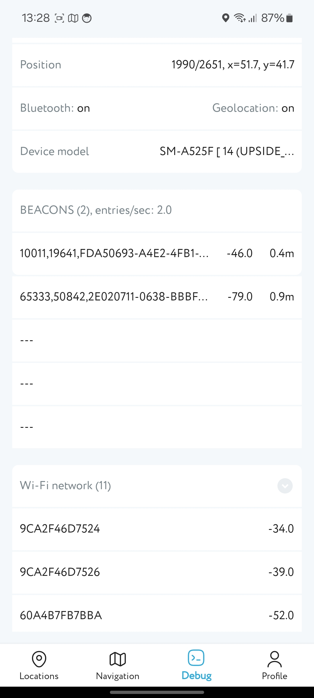

# Navigine Demo — Java / XML

A stable reference app showcasing the [Navigine Indoor Navigation SDK](https://github.com/Navigine/Indoor-Navigation-Android-Mobile-SDK-2.0) with a traditional Java/XML stack.

[](https://android-arsenal.com/api?level=23)
[](https://www.java.com)
[](https://developer.android.com)

> **Looking for a modern stack?** Check out [NavigineDemoCompose](../NavigineDemoCompose/) — the actively maintained Kotlin/Compose version of this demo.
 
---

## Screenshots

&nbsp;&nbsp;
 
---

## What's inside

| Screen         | Description                     |
|----------------|---------------------------------|
| **Navigation** | Indoor map, route building      |
| **Locations**  | Browse and select a location    |
| **Debug**      | Live position, sensors, signals |
 
---

## Tech Stack

- **Language:** Java
- **UI:** XML Views, Fragments
- **Architecture:** Traditional Android (Activity/Fragment)
- **State:** Callbacks, Handler
---

## Getting Started

**1. Clone and open in Android Studio:**

```bash
git clone https://github.com/Navigine/Indoor-Navigation-Android-Mobile-SDK-2.0.git
cd Indoor-Navigation-Android-Mobile-SDK-2.0/NavigineDemo
```

**2. Configure the SDK** — enter your server URL and user hash on the Login screen.

> Don't have credentials? [Get started at locations.navigine.com](https://locations.navigine.com/login)

**3. Build and run on a real device** — recommended for BLE and sensor features.
 
---

## Permissions

| Permission                             | Reason                             |
|----------------------------------------|------------------------------------|
| `ACCESS_FINE_LOCATION`                 | Indoor positioning                 |
| `BLUETOOTH_SCAN` / `BLUETOOTH_CONNECT` | BLE beacon scanning (Android 12+)  |
| `ACCESS_BACKGROUND_LOCATION`           | Background positioning (if needed) |
 
---

## Troubleshooting

**No beacons** — ensure Bluetooth and Location are enabled and battery optimizations are disabled for the app.

**Blank map** — verify your server URL, user hash, and that the selected location ID is valid.