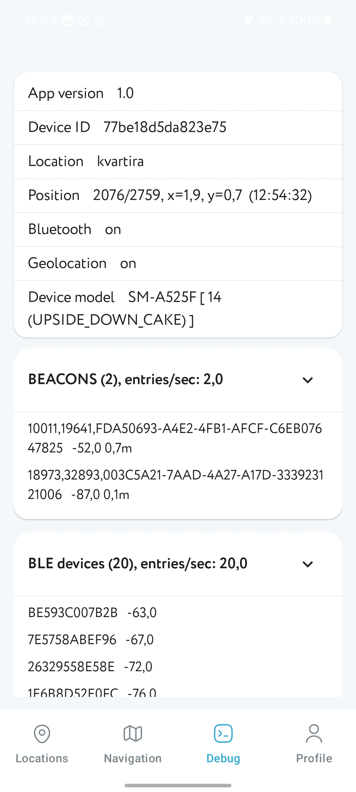

# Navigine Demo — Kotlin / Jetpack Compose

A production-ready reference app showcasing the [Navigine Indoor Navigation SDK](https://github.com/Navigine/Indoor-Navigation-Android-Mobile-SDK-2.0) with a modern Android stack.

[](https://android-arsenal.com/api?level=26)
[](https://developer.android.com)

---

## Screenshots

&nbsp;&nbsp;&nbsp;&nbsp;

---

## What's inside

| Screen         | Description                                        |
|----------------|----------------------------------------------------|
| **Navigation** | Indoor map, route building, FAB, bottom sheet      |
| **Locations**  | Search and select a location                       |
| **Debug**      | Live position, sensors, signals, BT/Location state |
| **Profile**    | View/edit, logout                                  |

**Key patterns demonstrated:**
- SDK initialization and readiness state machine (`Idle → Configuring → Ready → Error`)
- QR onboarding (server URL + user hash + optional location)
- Position and route subscriptions via Monitors (lifecycle-safe SDK listener wrappers)
- Dynamic base URL with Retrofit interceptor
- Hilt DI across all layers

---

## Tech Stack

- **Language:** Kotlin, Coroutines, Flow
- **UI:** Jetpack Compose, Material 3, Navigation Compose
- **DI:** Dagger Hilt
- **Storage:** DataStore (Preferences)
- **Network:** Retrofit + OkHttp + Moshi
- **Map:** [navigine-locationview-compose](../LocationViewCompose/)

---

## Project Structure

```
app/
├── ui/
│   ├── login/        # Login flow and QR onboarding
│   ├── navigation/   # Map screen + route UI
│   ├── locations/    # Location list
│   ├── debug/        # Debug snapshot UI
│   └── profile/      # Profile view/edit
├── core/
│   ├── sdk/          # NavigineSdkManager
│   ├── di/           # Hilt modules
│   └── log/          # AppLogger interface
└── data/             # Repositories, DTOs, domain interfaces
```

---

## Getting Started

**1. Clone and open in Android Studio:**

```bash
git clone https://github.com/Navigine/Indoor-Navigation-Android-Mobile-SDK-2.0.git
cd Indoor-Navigation-Android-Mobile-SDK-2.0/NavigineDemoCompose
```

**2. Build and run on a real device** — recommended for BLE and sensor features.

**3. Log in:** enter your Navigine server URL and user hash on the Login screen, or scan a QR code with those parameters.

> Don't have credentials? [Get started at locations.navigine.com](https://locations.navigine.com/login)

**4. (Optional) Enable Firebase:** place your `google-services.json` into `app/` and keep the Firebase plugins in `app/build.gradle.kts`. To opt out — remove the plugins and Firebase dependencies.

---

## Permissions

| Permission                             | Reason                             |
|----------------------------------------|------------------------------------|
| `CAMERA`                               | QR code scanning                   |
| `ACCESS_FINE_LOCATION`                 | Indoor positioning                 |
| `BLUETOOTH_SCAN` / `BLUETOOTH_CONNECT` | BLE beacon scanning (Android 12+)  |
| `ACCESS_BACKGROUND_LOCATION`           | Background positioning (if needed) |

Battery optimization exception is recommended to keep scanning active in the background.

---

## Troubleshooting

**"SDK is not configured"** — complete Login or QR onboarding first. The SDK becomes `Ready` only after a successful `configure(server, hash)`.

**No beacons in background** — ensure Bluetooth and Location are on and battery optimizations are disabled for the app.

**Route not visible** — confirm the selected location/sublocation matches your map data. Check the Debug screen for current position and sensor state.

**Server unreachable** — the base URL is rewritten dynamically on every request; make sure your server URL is reachable from the device's network.