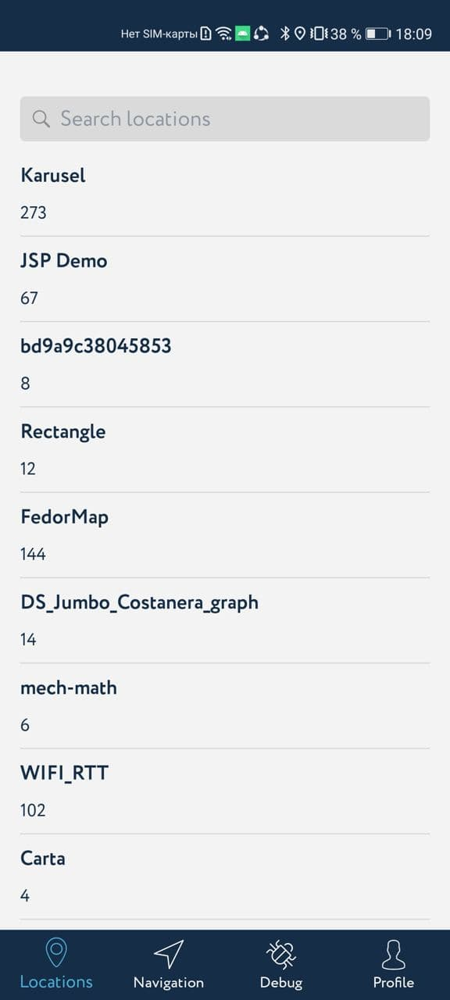
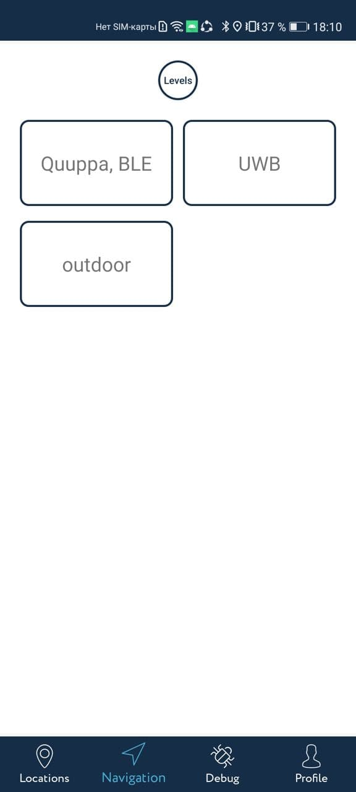
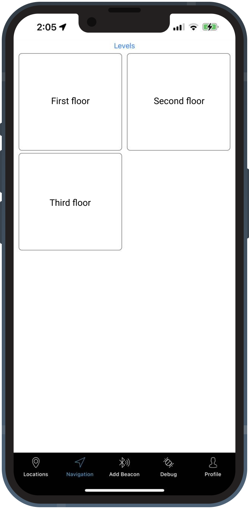

<a href="http://navigine.com"></a>

# Android SDK 2.0

The following sections describe the contents of the Navigine Android SDK repository. The files in our public repository for Android are: 

- Sources of the Navigine Demo Application for Android
- Navigine SDK for Android in form of a AAR file

## Useful Links

- [SDK Documentation](https://github.com/Navigine/Indoor-Navigation-Android-Mobile-SDK-2.0/wiki)
- Refer to the [Navigine official documentation](https://docs.navigine.com) for complete list of downloads, useful materials, information about the company, and so on.
- [Get started](http://client.navigine.com/login) with Navigine to get full access to Navigation services, SDKs, and applications.
- Refer to the Navigine [User Manual](http://docs.navigine.com/) for complete product usage guidelines.
- Find company contact information at the official website under <a href="https://navigine.com/contacts/">Contact</a> tab.

## Android Demo Application

Navigine Demo application for Android enables you to test indoor navigation as well as measure your target location's radiomap.
Source files as well as compiled application reside in the Navigine folder and nested folders.

To get the Navigine demo application for Android,

- Either [download the precompiled APK file](https://github.com/Navigine/Android-SDK-2.0/blob/master/NavigineDemo/NavigineDemo-debug.apk).
- Or compile the application yourself [using sources, available at GitHub](https://github.com/Navigine/Android-SDK-2.0/tree/master/NavigineDemo).

For complete guidelines on using the Demo, refer to the [corresponding sections in the Navigine User Manual](http://docs.navigine.com/ud_android_demo.html), or refer to the Help file incorporated into the application.

Below, you can see some screenshots of the Demo representing locations list, defined location levels, navigation bar, and debug process.

  

## Navigation SDK and Implementation

Navigine SDK for Android applications enables you to develop your own indoor navigation apps using the well-developed methods, classes, and functions created by the Navigine team.
The SDK file resides in the libs folder.

Find formal description of Navigine-SDK API including the list of classes and their public fields and methods at [Navigine SDK wiki](https://github.com/Navigine/Android-SDK-2.0/wiki).

### Using .aar file in Android Studio

- Download `libnavigine.aar` file from current repositories `libs` folder;
- In your project choose `File` -> `New` -> `New module` -> `Import .JAR/.AAR Package`;
- Select downloaded `libnavigine.aar` file and add it to your project as new module;
- Add following lines inside `dependencies` module in your apps `build.gradle` file:
```
  implementation project(":libnavigine")
```
- Start using Navigine SDK.

### Using with Jitpack

Will be added soon...
