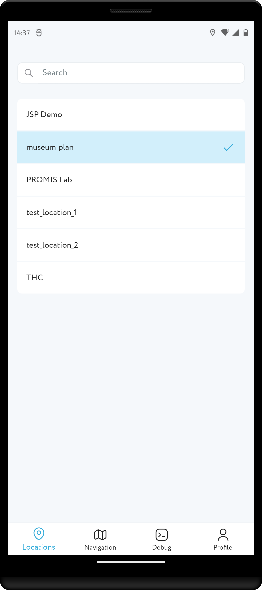
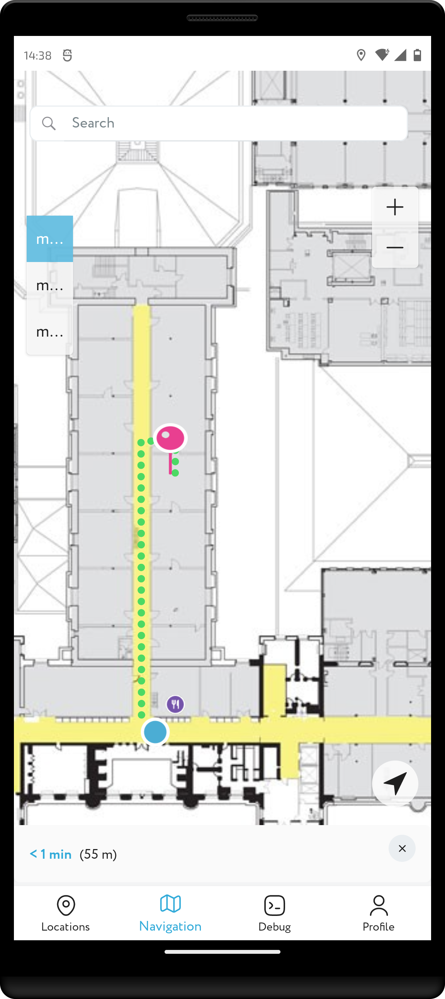
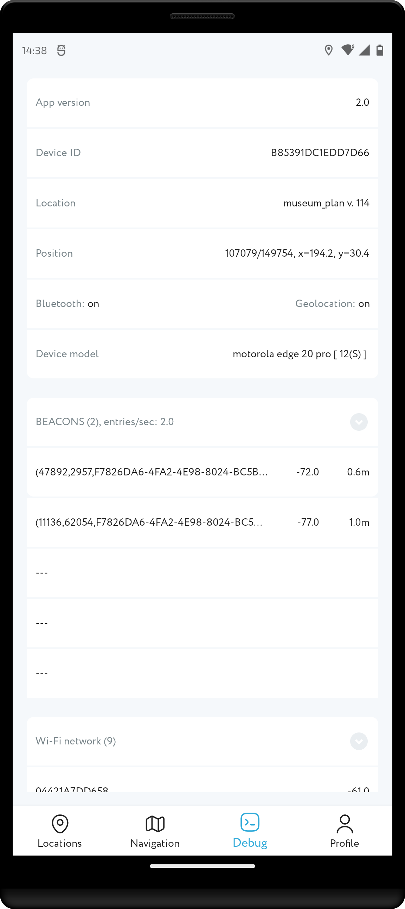

<a href="http://navigine.com"></a>

# Android SDK 2.0

The following sections describe the contents of the Navigine Android SDK repository. The files in our public repository for Android are: 

- Sources of the Navigine Demo Application for Android
- Navigine SDK for Android in form of a AAR file

## Useful Links

- [SDK Documentation](https://github.com/Navigine/Indoor-Navigation-Android-Mobile-SDK-2.0/wiki)
- Refer to the [Navigine official documentation](https://docs.navigine.com) for complete list of downloads, useful materials, information about the company, and so on.
- [Get started](http://locations.navigine.com/login) with Navigine to get full access to Navigation services, SDKs, and applications.
- Refer to the Navigine [User Manual](http://docs.navigine.com/) for complete product usage guidelines.
- Find company contact information at the official website under <a href="https://navigine.com/contacts/">Contact</a> tab.

## Values and benefits
1. High Accuracy: The Indoor Navigation Android Mobile SDK 2.0 offers high accuracy indoor positioning technology, which can detect the user's location within 2-5 meters, providing reliable indoor navigation and wayfinding solutions.

2. Customizable: The SDK is highly customizable, enabling developers to tailor the technology to their specific needs and create unique indoor navigation solutions for different industries.

3. Scalable: The SDK is designed to be scalable, making it suitable for businesses of all sizes, from small retail stores to large-scale venues such as airports and shopping malls.

4. Multi-Platform Support: The SDK offers multi-platform support, which means that it can be integrated into different mobile platforms, such as Android, iOS, and React Native.

5. Easy Integration: The SDK offers easy integration, providing developers with comprehensive documentation and technical support to ensure smooth and fast integration.

6. Advanced Features: The SDK comes with advanced features such as geofencing, location-based notifications, and analytics, allowing businesses to gain insights into customer behavior and improve their overall operations.

7. Enhanced User Experience: The Indoor Navigation Android Mobile SDK 2.0 can provide enhanced user experiences, including turn-by-turn navigation, voice instructions, and real-time location tracking, making it easier for users to navigate indoor environments and find their destinations.

The Indoor Navigation Android Mobile SDK 2.0 provides businesses with reliable and accurate indoor navigation technology that can be customized to their specific needs, providing an enhanced user experience, improving customer satisfaction, and increasing business efficiency.

## Android Demo Application

Navigine Demo application for Android enables you to test indoor navigation as well as measure your target location's radiomap.
Source files as well as compiled application reside in the Navigine folder and nested folders.

To get the Navigine demo application for Android,

- Either [download the precompiled APK file](https://github.com/Navigine/Android-SDK-2.0/blob/master/NavigineDemo/NavigineDemo-debug.apk).
- Or compile the application yourself [using sources, available at GitHub](https://github.com/Navigine/Android-SDK-2.0/tree/master/NavigineDemo).

For complete guidelines on using the Demo, refer to the [corresponding sections in the Navigine User Manual](https://docs.navigine.com/en/Using_Navigine_Application_for_Android), or refer to the Help file incorporated into the application.

Below, you can see some screenshots of the Demo representing locations list, defined location levels, navigation bar, and debug process.

  &nbsp;&nbsp;&nbsp;&nbsp;&nbsp;&nbsp;&nbsp;&nbsp;&nbsp;&nbsp;&nbsp;&nbsp;

## Navigation SDK and Implementation

Navigine SDK for Android applications enables you to develop your own indoor navigation apps using the well-developed methods, classes, and functions created by the Navigine team.
The SDK file resides in the libs folder.

Find formal description of Navigine-SDK API including the list of classes and their public fields and methods at [Navigine SDK wiki](https://github.com/Navigine/Android-SDK-2.0/wiki).

### Using .aar file in Android Studio

- Download `libnavigine.aar` file from current repositories `libs` folder;
- In your project choose `File` -> `New` -> `New module` -> `Import .JAR/.AAR Package`;
- Select downloaded `libnavigine.aar` file and add it to your project as new module;
- Add following lines inside `dependencies` module in your apps `build.gradle` file:
```
  implementation project(":libnavigine")
```
- Start using Navigine SDK.

### Using with Jitpack

Will be added soon...

### Android&HW compatibility
Indoor positioning SDK and applications require Android 8.0 or higher as well your smartphone should have BLE 4.0 or higher.

We are testing our SDK and Apps on the following smartphones:
Nexus Pixel 3	(Android 12),  Honor 30 pro (Android	10), Xiaomi Redmi	9C (Android	10), Samsung A20 (Android 10, 11), Huawei P20 lite (Android	9), Xiaomi Note	 (Android	8).
