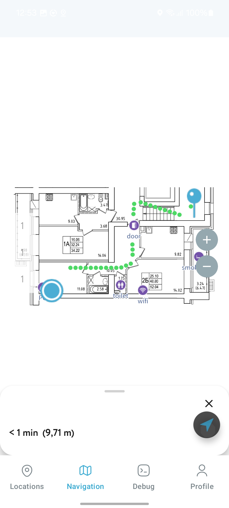
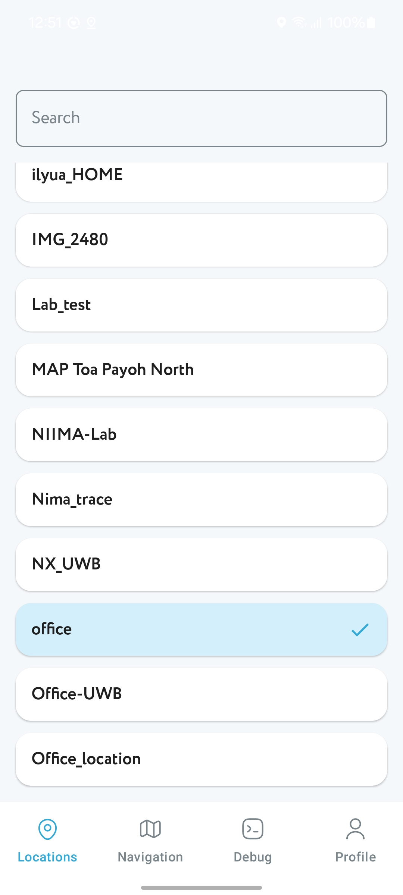

<p align="center">
  <a href="https://navigine.com">
    
  </a>
</p>

<p align="center">
    <a href="https://github.com/Navigine/Indoor-Navigation-Android-Mobile-SDK-2.0/releases"></a>
  <a href="https://android-arsenal.com/api?level=26"></a>
  <a href="https://jitpack.io/#Navigine/Indoor-Navigation-Android-Mobile-SDK-2.0"></a>
  <a href="mailto:info@navigine.com"></a>
</p>

<p align="center">
  Indoor positioning and navigation SDK for Android — BLE, Wi-Fi, UWB support, real-time routing, and map rendering.
</p>

---

https://github.com/user-attachments/assets/182dca62-4b5a-4ec2-bf01-1adbcf22813c
 
---

## Quick Start

**Via JitPack:**

```kotlin
// settings.gradle.kts
dependencyResolutionManagement {
    repositories {
        maven("https://jitpack.io")
    }
}

// build.gradle.kts
dependencies {
    implementation("com.github.Navigine.Indoor-Navigation-Android-Mobile-SDK-2.0:libnavigine:2.25.1")
}
```

**Via AAR:** download [`libnavigine.aar`](libs/) and add as a local module.

---

## What's in this repo

### 📦 [Navigine SDK](libs/)
The core indoor navigation SDK. Handles positioning, routing, map rendering, and radio measurements. This is the main product — everything else in this repo is built on top of it.

---

### 🗺 [LocationViewCompose](LocationViewCompose/)
A Compose wrapper around the SDK's `LocationView`. Use this if you're building a Compose-based app and want idiomatic Compose APIs instead of working with the View directly.

```kotlin
dependencies {
    implementation("com.navigine:navigine-locationview-compose:2.25.1")
}
```


---

### 🚀 [Demo — Kotlin/Compose](NavigineDemoCompose/)
A production-ready reference app showing how to integrate the SDK and `LocationViewCompose` — Hilt, Clean Architecture, Coroutines/Flow, Material 3.

[📥 Download APK](https://github.com/Navigine/Indoor-Navigation-Android-Mobile-SDK-2.0/releases) · [Browse source](NavigineDemoCompose/)

&nbsp;&nbsp;

---

### ☕ [Demo — Java/XML](NavigineDemo/)
A stable reference app for teams working with a Java/XML codebase.

[📥 Download APK](https://github.com/Navigine/Indoor-Navigation-Android-Mobile-SDK-2.0/releases) · [Browse source](NavigineDemo/)

---

📂 **Looking for specific use cases?** Check out [Examples →](Examples/) — minimal single-Activity samples for navigation, routing, camera control, map objects, and more.

---

## Why Navigine

- **Accurate indoor positioning** — BLE, Wi-Fi, UWB, sensor fusion
- **Real-time routing** — turn-by-turn navigation with async route building
- **Map rendering** — interactive indoor maps with custom objects and 3D models
- **Multi-venue** — manage and switch between locations from a single SDK instance

---

## Requirements

- Android 8.0+ (API 26)
- BLE 4.0+

---

## Links

- [Documentation](https://docs.navigine.com)
- [SDK Wiki & API Reference](https://github.com/Navigine/Indoor-Navigation-Android-Mobile-SDK-2.0/wiki)
- [Community](https://community.navigine.com)
- [Locations Portal](https://locations.navigine.com)
- [Contact](https://navigine.com/contacts/) · [info@navigine.com](mailto:info@navigine.com)