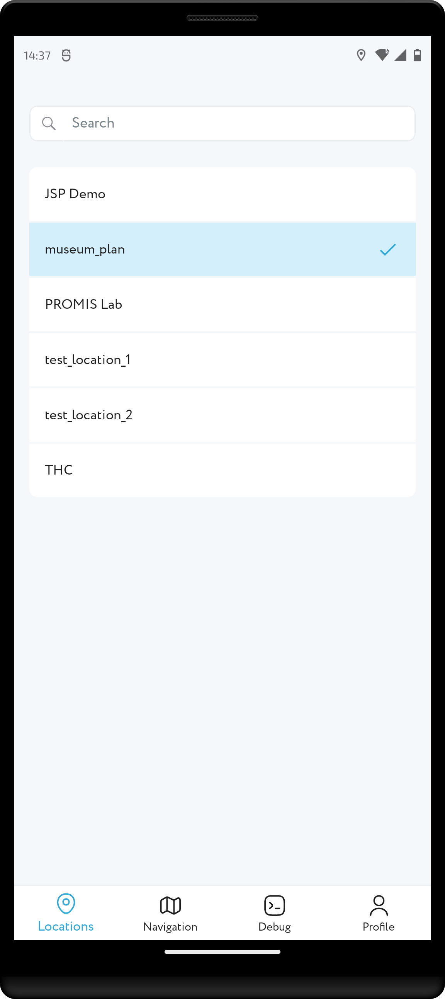
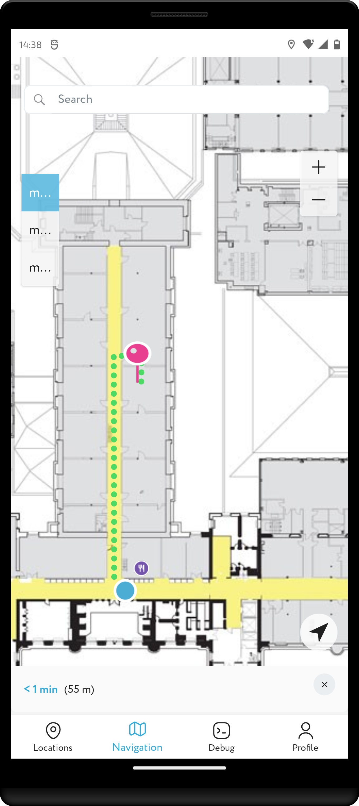
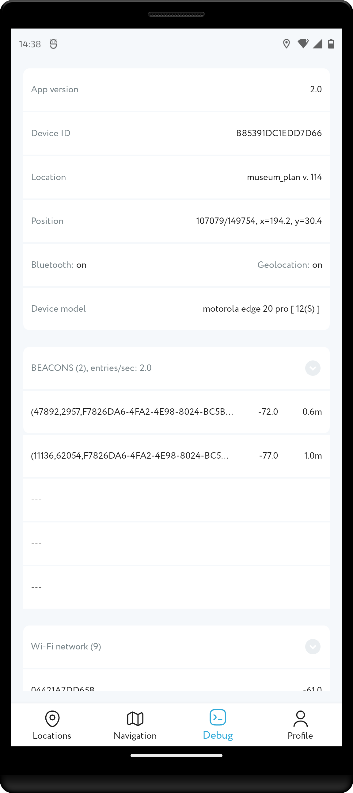

<a href="http://navigine.com"></a>

# Android SDK 2.0

The following sections describe the contents of the Navigine Android SDK repository. The files in our public repository for Android are: 

- Sources of the Navigine Demo Application for Android
- Navigine SDK for Android in form of a AAR file

## Useful Links
- Learn more about our solutions on [the Navigine website](https://navigine.com/)
- [SDK Documentation](https://github.com/Navigine/Indoor-Navigation-Android-Mobile-SDK-2.0/wiki)
- Refer to the [Navigine official documentation](https://docs.navigine.com) for complete list of downloads, useful materials, information about the company, and so on.
- [Get started](http://locations.navigine.com/login) with Navigine to get full access to Navigation services, SDKs, and applications.
- Refer to the Navigine [User Manual](http://docs.navigine.com/) for complete product usage guidelines.
- Find company contact information at the official website under <a href="https://navigine.com/contacts/">Contact</a> tab.
- [Join our community](https://community.navigine.com/t/indoor-navigation-android-mobile-sdk-2-0/177) to discuss this project. Share your use cases, questions, and suggestions

## Values and benefits

<p align="center"></p>

**Enhanced User Experience**: An Indoor Navigation SDK for Android provides users with an intuitive and seamless navigation experience within indoor environments. It helps them easily navigate complex spaces such as shopping malls, airports, museums, or hospitals, reducing confusion and improving overall user satisfaction.

**Accurate Positioning**: The SDK utilizes advanced positioning technologies, such as Bluetooth Low Energy (BLE), Wi-Fi, UWB etc., to achieve high accuracy in indoor positioning. Users can rely on precise location information to navigate to specific destinations, find points of interest, and locate desired products or services within a venue.

**Indoor Mapping and Wayfinding**: The SDK offers indoor mapping capabilities, allowing developers to integrate detailed maps of indoor spaces into their Android applications. Users can benefit from interactive maps, highlighted routes, and turn-by-turn directions to efficiently navigate through the venue and reach their desired destinations.

**Location-Based Services**: With an Indoor Navigation SDK, developers can build Android applications that offer location-based services tailored to specific indoor environments. This opens up opportunities to provide personalized recommendations, targeted promotions, and context-aware information based on the user's location within the venue.

**Integration with Existing Apps**: The SDK can be seamlessly integrated into existing Android applications, enhancing their functionality with indoor navigation capabilities. This enables businesses and organizations to leverage their existing user base and infrastructure, saving time and resources while providing a value-added service to their customers.

**Improved Operational Efficiency**: For businesses and organizations, an Indoor Navigation SDK can optimize operational efficiency. It can assist in managing crowds, monitoring visitor flows, and optimizing resource allocation within a venue. This data-driven approach helps businesses streamline their operations, improve staff productivity, and enhance the overall visitor experience.

**Analytics and Insights**: An Indoor Navigation SDK often includes analytics and reporting functionalities, providing valuable insights into user behavior, traffic patterns, and popular areas within a venue. Businesses can leverage this data to make informed decisions, optimize space utilization, and identify opportunities for improvements or revenue generation.

**Multi-Venue Support**: Many Indoor Navigation SDKs offer support for multiple venues, allowing businesses to provide a consistent navigation experience across different locations. This flexibility is particularly beneficial for large retail chains, airports, or exhibition centers with multiple venues under their operation.

**Customization and Branding**: The SDK provides customization options, allowing developers to tailor the indoor navigation experience to match their branding and user interface guidelines. This ensures a consistent and cohesive user experience within the application, reinforcing brand identity and familiarity.

**Developer-Friendly Tools and Support**: Indoor Navigation SDKs come with comprehensive documentation, developer tools, and dedicated support channels. This empowers developers to efficiently integrate and utilize the SDK, accelerating the development process and ensuring a smooth implementation.

## Android Demo Application

Navigine Demo application for Android enables you to test indoor navigation as well as measure your target location's radiomap.
Source files as well as compiled application reside in the Navigine folder and nested folders.

To get the Navigine demo application for Android,

- Either [download the precompiled APK file](https://github.com/Navigine/Android-SDK-2.0/blob/master/NavigineDemo/NavigineDemo-debug.apk).
- Or compile the application yourself [using sources, available at GitHub](https://github.com/Navigine/Android-SDK-2.0/tree/master/NavigineDemo).

For complete guidelines on using the Demo, refer to the [corresponding sections in the Navigine User Manual](https://docs.navigine.com/en/Using_Navigine_Application_for_Android), or refer to the Help file incorporated into the application.

Below, you can see some screenshots of the Demo representing locations list, defined location levels, navigation bar, and debug process.

  &nbsp;&nbsp;&nbsp;&nbsp;&nbsp;&nbsp;&nbsp;&nbsp;&nbsp;&nbsp;&nbsp;&nbsp;

## Navigation SDK and Implementation

Navigine SDK for Android applications enables you to develop your own indoor navigation apps using the well-developed methods, classes, and functions created by the Navigine team.
The SDK file resides in the libs folder.

Find formal description of Navigine-SDK API including the list of classes and their public fields and methods at [Navigine SDK wiki](https://github.com/Navigine/Android-SDK-2.0/wiki).

### Using .aar file in Android Studio

- Download `libnavigine.aar` file from current repositories `libs` folder;
- In your project choose `File` -> `New` -> `New module` -> `Import .JAR/.AAR Package`;
- Select downloaded `libnavigine.aar` file and add it to your project as new module;
- Add following lines inside `dependencies` module in your apps `build.gradle` file:
```
  implementation project(":libnavigine")
```
- Start using Navigine SDK.

### Using with Jitpack

[](https://jitpack.io/#Navigine/Indoor-Navigation-Android-Mobile-SDK-2.0)

JitPack lets you consume this repository (and its Gradle modules) directly from GitHub.

**1) Add the JitPack repository**

<details>
<summary><code>settings.gradle.kts</code> (recommended)</summary>

```kotlin
dependencyResolutionManagement {
    repositoriesMode.set(RepositoriesMode.FAIL_ON_PROJECT_REPOS)
    repositories {
        google()
        mavenCentral()
        maven("https://jitpack.io")
    }
}
```
</details>

<details>
<summary><code>build.gradle.kts</code> (legacy projects)</summary>

```kotlin
repositories {
    google()
    mavenCentral()
    maven("https://jitpack.io")
}
```
</details>

**2) Add a dependency**

- To depend on the **root artifact** (single-module publish):
```kotlin
dependencies {
    implementation("com.github.Navigine:Indoor-Navigation-Android-Mobile-SDK-2.0:<TAG>")
}
```

- To depend on a **specific module** from this monorepo (multi-module publish), use:
```kotlin
dependencies {
    // Example: take a module named "libnavigine" (replace with actual module name)
    implementation("com.github.Navigine.Indoor-Navigation-Android-Mobile-SDK-2.0:libnavigine:<TAG>")
}
```

> Use a Git tag/release (recommended) or a commit hash as `<TAG>`.

## Jetpack Compose wrapper: LocationView Compose

A modern, production-ready Compose wrapper around Navigine’s `LocationView` — inspired by the quality bar of
`android-maps-compose`. It provides idiomatic Compose APIs, lifecycle-aware state, and property updaters.

**Highlights**
- Drop-in `@Composable` map container for Navigine SDK
- Camera state with smooth, coroutine-friendly updates
- Input & pick handlers (tap/long-press, feature/object picking)
- Polylines/polygons/circles as declarative map objects
- Proper cleanup across recompositions & lifecycle events

### Getting started

**1) Add dependencies**

```kotlin
dependencies {
    // Note: core sdk is pulled transitively with the library
    implementation("com.navigine:navigine-locationview-compose:1.7.2")
}
```

> Make sure the MavenCentral repository is added to your project as shown above.

**2) Initialize Navigine SDK once (e.g., in Application or an early Activity)**

```kotlin
val sdk = com.navigine.idl.java.NavigineSdk.getInstance().apply {
    setServer("https://ips.navigine.com")
    setUserHash("<YOUR-USER-HASH>")
}
sdk.locationManager.locationId = <YOUR_LOCATION_ID>
```

**3) Required permissions**

Grant Location + Bluetooth (BLE) permissions according to your target SDK (foreground + background if needed).  
Ensure the device supports BLE (Android 8.0+ as per SDK requirements).

### Quick start (Compose)

```kotlin
@Composable
fun LocationSample() {
    val cameraState = com.navigine.locationview.camera.rememberNavCameraPositionState()

    com.navigine.locationview.compose.NavigineLocation(
        cameraPositionState = cameraState,
        onWindowReady = { window ->
            // Example: set initial sublocation if needed
            window.setSublocationId(<SUBLOCATION_ID>)
        }
    ) {
        // Optional: input handling & picking out of the box
        com.navigine.locationview.compose.InputHandlers(
            autoPickObjectOnTap = true,
            autoPickFeatureOnTap = true,
        )

        com.navigine.locationview.compose.PickHandlers(
            onObjectPicked = { result, viewPt ->
                // Handle object pick
            },
            onFeaturePicked = { attrs, viewPt ->
                // Handle feature pick (e.g., show bottom sheet)
            }
        )

        // Examples of shapes:
        // com.navigine.locationview.compose.Polyline(...)
        // com.navigine.locationview.compose.Polygon(...)
        // com.navigine.locationview.compose.Circle(...)
    }
}
```

### Camera control

```kotlin
val camera = cameraState
LaunchedEffect(Unit) {
    // Animate or move camera (example API)
    camera.animateTo(
        target = com.navigine.locationview.model.NavPoint(x = 10.0, y = 20.0),
        zoom = 1.2f
    )
}
```

### Samples

A sample app with bottom navigation shows 4 demos (Camera, Shapes, Input, Icons) that you can use as a reference for
routing, drawing shapes, and handling taps. It’s a good starting point for your own project structure.

### Notes

- The wrapper takes care of resource cleanup and respects recomposition & lifecycle.
- For release builds, remember to keep your SDK classes if using R8/Proguard (add rules as needed).

### Android&HW compatibility
Indoor positioning SDK and applications require Android 8.0 or higher as well your smartphone should have BLE 4.0 or higher.

We are testing our SDK and Apps on the following smartphones:
Nexus Pixel 3	(Android 12),  Honor 30 pro (Android	10), Xiaomi Redmi	9C (Android	10), Samsung A20 (Android 10, 11), Huawei P20 lite (Android	9), Xiaomi Note	 (Android	8).
